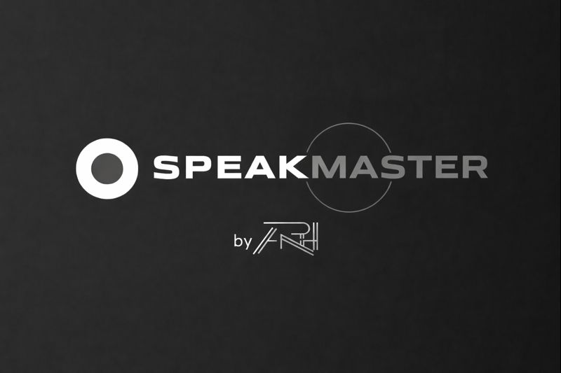

# SpeakMaster by ARH

> Your AI-Powered IELTS Speaking Coach — Master the IELTS speaking test with real-time AI feedback, speech recognition, and gamified progression.



## Overview

SpeakMaster is a comprehensive IELTS speaking practice application designed to help you achieve your target band score. Using advanced AI technology and real-time speech recognition, it provides personalized feedback on your speaking performance across all four IELTS speaking criteria:

- **Fluency & Coherence**
- **Lexical Resource**
- **Grammatical Range & Accuracy**
- **Pronunciation**

## Key Features

| Feature | Description |
|---------|-------------|
| **Real-time Speech Recognition** | Advanced Web Speech API integration for accurate transcription and instant feedback |
| **AI-Powered Analysis** | Groq AI (llama-3.3-70b-versatile) analyzes responses for fluency, grammar, pronunciation, and lexical resource using IELTS criteria |
| **Band Score Tracking** | Detailed band scores for each criterion with progress tracking toward your target |
| **Achievement System** | 15 unlockable badges and achievements through gamified practice |
| **Vocabulary Bank** | Save words from AI feedback with spaced repetition review (levels 0–5) |
| **Session History** | Review past sessions with full transcripts, scores, and AI feedback |
| **XP & Streak System** | Earn 10 XP per session, 25 XP per lesson; maintain daily streaks |
| **Personalized AI Content** | AI-generated content tailored to your history and learning progress |

## Training Protocols (Practice Modules)

### Neural Voice — Live Mock Exam
Full-length IELTS speaking simulation with AI examiner. Experience real exam conditions with all three parts (Introduction, Cue Card, Discussion). Choose examiner types (Professional, Encourager, Academic) and acoustic profiles (Silent Room, Café Ambience, Exam Hall).

### Cue Protocol — Part 2 Practice
Master the 2-minute long turn with timed 60-second preparation and diagnostic analysis. Practice cue card topics with live transcription and structured feedback.

### Abstract Core — Part 3 Discussion
High-level reasoning practice for IELTS Part 3. Develop sophisticated responses to abstract questions with AI-generated vocabulary boosters and rephrasing suggestions.

### Phonetic Drill — Read Aloud
Precision pronunciation training with phonetic comparison and accuracy scoring. Read passages aloud and receive detailed phonetic analysis highlighting problem areas.

### Phonetics Practice — Sound Mastery
Target specific English phonemes (TH, R/L, vowels, diphthongs) with AI-powered pronunciation drills. Listen to native pronunciation, record yourself, and get immediate accuracy feedback.

### Skill Forge — Micro Drills
Targeted exercises including:
- **Idiom Master** — Learn contextual idiom usage and practice in sentences
- **Intonation Mirroring** — Listen to native stress patterns and mirror them
- **Phonetics Practice** — Focused phoneme drills with AI feedback

### Stammer Shield — Fluency Builder
Neutralize hesitations, filler words, and stammering patterns. Build smooth, confident speech through progressive phrase practice with filler detection and fluency scoring.

### Journey Map — Learning Roadmap
Gamified progression from Band 5 to Band 9 with structured lessons, prerequisites, and XP rewards.

### Data Telemetry — Analytics Dashboard
Comprehensive performance tracking with activity heatmaps, score trends, and AI-powered weakness detection.

## How It Works

1. **Create your account** — Sign up and sign in to get your personalized dashboard
2. **Set up your API key** — Get a free Groq API key and configure it in settings
3. **Choose a practice module** — Select from 7+ different practice types
4. **Speak and get feedback** — Practice speaking while AI transcribes and analyzes in real-time
5. **Review and improve** — Get detailed band scores, AI feedback, and vocabulary suggestions

## Tech Stack

- **Frontend**: React 18 with TypeScript
- **Styling**: Tailwind CSS with custom "Stellar Mercury" design system
- **Backend**: Supabase (authentication, database, edge functions)
- **AI Engine**: Groq AI (llama-3.3-70b-versatile) for speech analysis
- **Speech**: Web Speech API for real-time transcription
- **Animations**: Framer Motion for page transitions and UI effects
- **Design**: Chrome glassmorphism, cosmic background, Lucide icons
- **Fonts**: Syncopate (headings), JetBrains Mono (HUD/tech), Plus Jakarta Sans (body)

## Design System — Stellar Mercury

SpeakMaster uses a custom dark theme called **Stellar Mercury** featuring:
- Chrome glassmorphism with blur and inner glow effects
- Cosmic animated background
- Custom cursor design
- 2.5-second ARH-branded splash screen
- Smooth framer-motion page transitions
- Strictly Lucide-react icons (no standard emojis)

## Creator

**Alokam Ruchith** — AI/ML Engineer

An aspiring engineer passionate about contributing to society through advancements in AI and ML. SpeakMaster represents a thoughtful initiative to empower individuals in improving their English communication skills using the power of AI technology.

## Getting Started

### Prerequisites
- Node.js & npm — [install with nvm](https://github.com/nvm-sh/nvm#installing-and-updating)

### Local Development

```sh
# Clone the repository
git clone <YOUR_GIT_URL>

# Navigate to the project directory
cd <YOUR_PROJECT_NAME>

# Install dependencies
npm install

# Start the development server
npm run dev
```

### Deploy

Open [Lovable](https://lovable.dev/projects/f9d73f59-56ed-4660-96fd-9f4ec75cf41c) and click **Share → Publish**.

## Live App

🔗 [speakmasterbyarh.lovable.app](https://speakmasterbyarh.lovable.app)

---

© 2025 SpeakMaster by ARH. All rights reserved.
